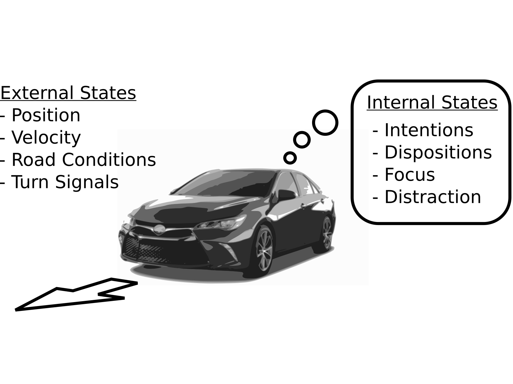

These are my most interesting projects, for broader coverage, please see the [publications](/publications) section and my [CV](/cv/cv.pdf).

# Behavior-Aware Autonomous Driving

<video autoplay="autoplay" loop="loop" width="100%" controls>
  <source src="/assets/videos/highway_planning.mp4" type="video/mp4">
  <source src="/assets/videos/highway_planning.webm" type="video/webm">
  <source src="/assets/videos/highway_planning.ogv" type="video/ogg">
  
</video>

In autonomous driving, there is an inherent tradeoff between safety and efficiency, especially time-efficiency.
If a self-driving car is to be perfectly safe, it cannot enter the road, and it can be the fastest if there are no safety constraints.
This tradeoff results in the Pareto curves shown in the figure below.
But the performance also depends on the model.
We showed that by modeling the latent internal states of the other drivers on the road, safety and efficiency can both be *simultaneously* improved (this corresponds to moving the Pareto curve).
In computational tests in a highway driving scenario, internal state modeling allowed the autonomous vehicle to perform a multiple-lane change maneuver nearly twice as fast with the same level of safety.

- Paper: [https://arxiv.org/abs/1702.00858 ](https://arxiv.org/abs/1702.00858)

# POMCPOW: An online algorithm for Continuous POMDPs

Leading online partially observable Markov decision process (POMDP) solvers such as POMCP and DESPOT can handle continuous state spaces, but they still struggle with continuous action and observation spaces.
In fact, it can be shown analytically that they will converge to suboptimal solutions for some POMDPs with continuous action spaces regardless of the amount of computation.
We have proposed a new algorithm, POMCPOW that overcomes these problems using progressive widening and weighted particle filtering. 

For example, in the light-dark example shown below, POMCP (top) cannot decide to localize in the light region, while POMCPOW (bottom) can, allowing it to hit the target at the origin much more quickly.

- Paper: [https://arxiv.org/abs/1709.06196 ](https://arxiv.org/abs/1709.06196)
- Code: [https://github.com/JuliaPOMDP/POMCPOW.jl ](https://github.com/JuliaPOMDP/POMCPOW.jl)

# Autonomous Autorotation

In 2013, we used autorotation to repeatedly successfully land a small autonomous helicopter without power.
The video below contains footage of one of the landings from a nose-mounted camera.
Note that the pilot releases control as he turns off the motor.

<iframe width="560" height="315" src="https://www.youtube.com/embed/mAFeDq9ZdH4" frameborder="0" allow="autoplay; encrypted-media" allowfullscreen></iframe>

- Paper: [http://www.ingentaconnect.com/content/ahs/jahs/2015/00000060/00000002/art00008 ](http://www.ingentaconnect.com/content/ahs/jahs/2015/00000060/00000002/art00008)
